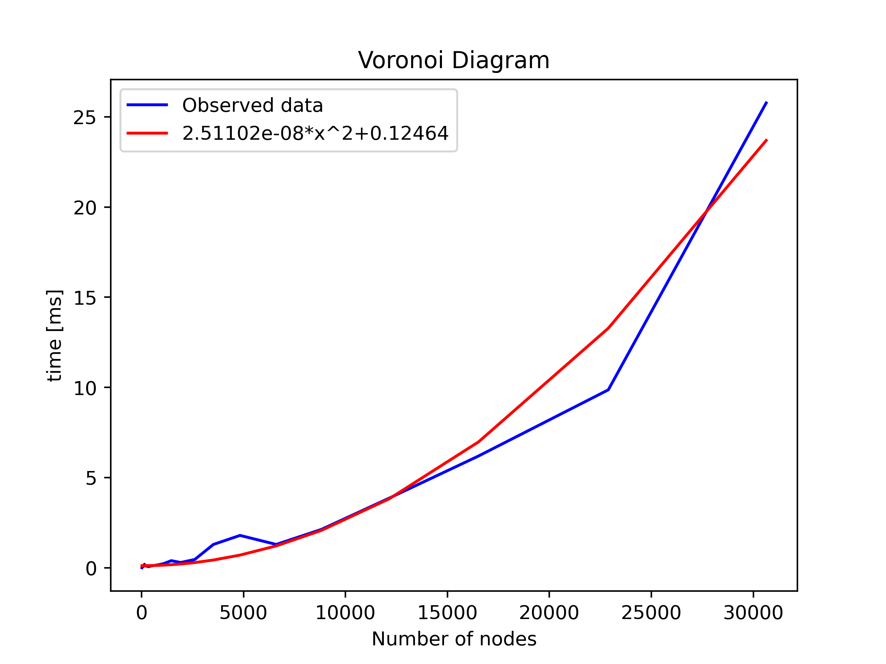

# Presentation of the algorithm

## Choice of the algorithm

Even though the last course presented the state of the art randomized incremental algorithm, we took the liberty not to use this one as nothing seemed to enforce it in the assignment

We instead chose to use the much more original and pretty sweep hull algorithm which has the same theoretical complexity.

Reasons why sweep hull is better than the classical approach:

- It is much prettier, yielding nice animations with propagating circles
- It is much more original, we didn't find many informations about this algorithm, we based the implementation exclusively on it's original paper (but still made some things differently)
- It is inspired from the well known sweep line algorithm, which is super cool
- It finds the convex hull as a bonus, even though the data structure we used allows to find it quite easily anyway
- It handles some pathological cases out of the box, like colinear or concyclic points, and doesn't make any assumption on the bounds between which the points lie
- It does all that with the same wors case complexity of O(n log n)

## Idea behind the algorithm

The sweep hull algorithm consists in two phases, the construction of an initial, non-overlaping mesh, and then a flipping phase to make the mesh Delaunay

## Construction of the non-overlaping mesh

As its name suggests, the sweep hull algorithm incrementally expands the convex hull of the subset of active vertices, which means that it has to have a convex hull to begin with.

This is done by following these steps:

- Randomly select a seed point
- Find it's nearest neighbor
- Find a third point so that the circumradius of the triangle formed by the three points is minimized
- Order the points, or vertices to get a counter-clockwise triangle and update the mesh structure accordingly (we used the same structure as in the last homework)

Note that the third step should ensure that there are no inactive points in the initial hull

This procedure leaves us with the desired seed hull

## Adding new vertices to the mesh

One should now sort the points according to their distance to the seed hull (we chose to use the circumcenter of the initial triangle to measure the distance, but other choices may work as well).

The points are then added one by one according to this order, but we still need a way to know which active vertices the new point should be linked to.

This is done by maintaining a list of the boundary edges (which will give us the convex hull in the end as mentioned above) and checking which ones are "visible" from the new point's perspective.

Concretely, this is done by checking if the normal vector of said edges is pointing towards (or away from, depending on which normal one considers) the new point. This works thanks to the counter-clockwise ordering of the nodes in the triangles and the fact that the new point is outside of the current hull.

The new point is then linked to the vertices defining the visible edges and the structure is updated accordingly (updating the twins and existing edges, adding edges and a new face, ...).

We then do this for all the other points and are left with a non-overlaping but not yet Delaunay triangulation.

## Making the triangulation Delaunay

According to the paper, the triangulation generated previously should be highly Delaunay to start with and not require too many flipping, which in our experience is debatable.

One should then iteratively find edges between triangles that are not in accordance with some sort of Delaunay condition, and this is where our implementation diverges from what's described in the paper.

In the paper they mention the use of precomputed circumcenters and squared circumradii, whereas we used a delaunay condition involving the angles of the triangles

This choice thus implies that we don't have to compute, store and update all this information in memory each time a flipping is done at the cost of a bunch of arctangents

The exact criterion is that the sum of the two angles formed by two triangles at the vertices not belonging to the current edge is smaller than 180°

If this condition is met, the latter vertices are outside of the other triangle's circumcircle and we go to the new edge, else we flip the edge

We do this for each edge and repeat the whole process untill all the edges meet the condition.

Eventually, we are left with a fully Delaunay triangulation.

# Deducing the Voronoi diagram

This step was quite straightforward: Iterate through all edges and create an edge between the circumcenters of the two incident faces

*Note: the structure we used for the mesh of the voronoi diagram is much simpler as we don't have to do any operation on it after it's creation*

But it then remained a problem, what to do with the semi-edges that form the boundary and thus don't have a twin?

The Voronoi diagram represent the regions where all points (of the domain, not vertices of the mesh) are closer to the corresponding vertex than to any other vertex in the mesh, this means that the missing boundaries should pass through the middle of the boundary edge

Once this was figured out, it simply was a matter of fonding the direction of the vector going from the single circumcenter to the middle of the boundary edge and creating a voronoi edge from said circumcenter to some arbitrary far away point in the determined direction. (This works well as long as nobody happens to zoom out too much)

# Possible improvements

We didn't make many optimisations apart from stopping the search for the third seed point when the minimum circumradius found so far is smaller than the distance to the point, which should potentially avoid going through all the points while still guaranteeing that no point lies in the seed hull (as the next tested point is further away from the triangle)

The different choice of delaunay condition could also be seen as an optimisation but we can't affirm that this is faster as we didn't try the other choice (this still saves memory though)

We also had the idea of thinking of a better way of finding the edges that are still not delaunay after the first pass (maybe by maintaing a list of faces that were impacted by a flip after having been flipped a first time)

# The fun(nier) part: The ☆☆Additionnal Features☆☆

You may note that a particular attention was given to making a clean and fun to fidget with (I actually played a lot with it during my blocus) UI.

The overal layout is quite simple, a simple small canvas (the default one actually) and a tabbed section with various features.

## The canvas

Just like in the previous homework the view can be moved by a mouse drag and zommed in and out through the mouse wheel

The zoom was also 'fixed' as it allowed to zoom out to negative values which left us with a flipped image (which most obviously was a feature, not a bug). Anyway, the zoom is now exponential which 'fixed' this feature and allowed for more uniform zooms (the zoom had increasingly less effect as it was simply multiplicative).

It is also possible to add points by clicking without dragging, simply note that it launches the algorithm (this allows for a more interactive experience)

(The possibilites to remove and move points are also being worked on as I'm writing this but if you're reading this, it wasn't finished in time)

## The options

### Display tab

In the Display tab one can find options related to what's shown and how it's rendered, namely options to show node indices, the hull, the mesh and the Voronoi diagram, and a select input allowing to change the theme of the view, populated with my favourite themes (mostly from KDE themes)

### SweepHull tab

In this tab, one can find options controlling the behaviour of the algorithm

- 'Start SweepHull' and 'Stop Sweephull' respectively start the algorithm with the specified delays and stop the algorithm in case the delays are too long
- Reload nodes clears all user-placed points and deletes the meshes
- The 'Meshing' and 'Flippinf' sub frames contain controls of the animation for the two main phases of the algorithm

In each frame, one can control the delay before the phase starts, the delay between each displayed step, and the steps that are rendered. On large meshes even with a 1 ms delay takes forever to finish meshing, so rendering only every 25th~30th steps makes the animation quick enough on 'Fine' and 'Fine Circle' for example.

### Nodes tab

In this tab, one can choose between predefined sets of nodes (generated with GMSH), or choose 'Custom' and either play with an empty canvas or upload a custom file.

The structure of the custom file consists in a json file with a single attribute "nodes" associated with a list of the nodes 3D positions.

We also provide a python script that extracts nodes from a .msh file and produces the correctrly formatted json file

The script is used as follows:

`python3 gmsh_to_json.py ${NAME_OF_SOURCE_FILE} ${NAME_OF_DESTINATION_FILE}`

where the filenames must include the extention

*WARNING* due to the absence of any kind of pattern matching and/or error catching, importing an incorrectly formatted file may result in severe injuries to (or the death of) the programm's process.

# Comparison with GMSH

As some kind of validation, here's a side-to side comparison between our result and the original GMSH mesh.

We went through the highly scientific process of staring at these images (and a few others) and found no difference, which we take as a validation of our results.

*(The nodes we used are those generated by this very gmsh mesh)*

# Pathological cases

## Colinear points

Here is how the algorithm behaves when given colinear points

When the points are colinear, there's no triangle to create and the expected result is thus not trivial, our implementation seems to create the initial triangle and then determine that colinear edges are not "visible" as we previously defined, it thus doesn't connect the nodes

We could make it connect all the nodes by changing the behavour of the function that determines which edge is visible, but we consider the current result as equally valable given the uncertainity on the expected result

One thing we observe is the absence of a voronoi diagram, which is explained by the fact that we deduce it from the mesh and that the mesh consists of a single triangle.

If we add another point, the code behaves normally and reveals how the voronoi diagram should have been:

## Cocircular points

In the case of cocircular points the algorithm behaves as expected, and there's no real reason why it wouldn't with this particular algorithm

We still tried with 4 points at the corners of the unit square, which yielded this:

Which is the expected result

## Points outside of the expected bounds

There"s no reason why the algorithm would't handle this, in fact he doesn't have to build an initial triangle containing all the points (which still could handle that case by not hard-coding the triangle's nodes)

On our html page the view initially corresponds to the unit square, but this is purely arbitrary and the back-end isn't sensible to points being outside of these bounds

# Complexity

It is important to look at how the execution times vary when the problem grows in size, namely when the number of nodes in a given mesh increases. In this section, we look at how the Sweep hull, delaunay and voronoi algortihms evolve. One should first ask themselves what one should observe.

For the sweep hull algorithm, the author provides no rigorous proof that his algorithm is O(nlog(n)), but he does provide empirical data for his algorithm and the classic algorithm. This data shows indeed that his algorithm seems to grow with O(nlogn) but with a smaller constant than q-hull. 

To get the Delaunay triangulation, we only need to flip adjacent pairs of triangles in the mesh after the sweep hull algorithm is done. It is hard to predict what the complexity of that operation would be, but the numerical experiments suggest that it does not exceed O(nlog(n)).

What we should see for the Voronoi diagram, is something that grows quadratically. The reason is because we loop over every triangle and then when we are done looping over the triangles, we loop over every edge. The complexity is therefore O(n_triangles + n_edges) which is O(n^2). (Here n is number of nodes)

For the sweep hull, we can indeed see that it is O(nlog(n)) since we can fit the data by a function of that form.

The same goes for the delaunay triangulation.

For the Voronoi diagram, we find that it is O(n^2) as expected.

